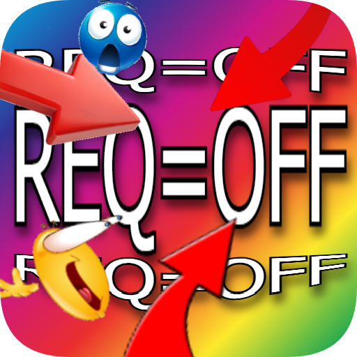
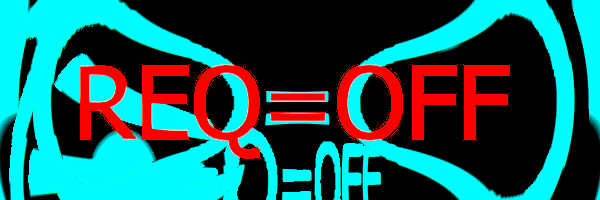
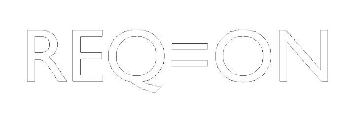

# **REQIndicator**
Mod that adds REQ indicator to Geometry Dash

# **Epilepsy warning!**

**This mod contains flashing lights!**

# About this mod

This mod adds REQ indicator to your top left corner.
It useful for streamers that dont want to every time say to chat something like
**IM NOT GOING TO PLAY UR LEVELZ!!!!1!!!11!1!**

But with this mod every watcher will know that u are not going to do that.
# Credits
Idea by [HeXi](https://github.com/hexique)

 render by [HeXi](https://github.com/hexique)

 render by me

code by me

# Prewiew
REQ=OFF animation

REQ=ON animation (a little bit slow here)

